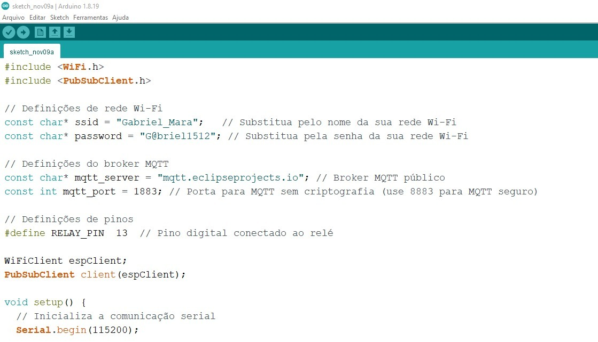
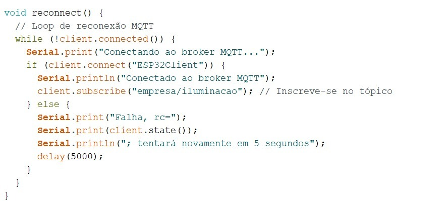
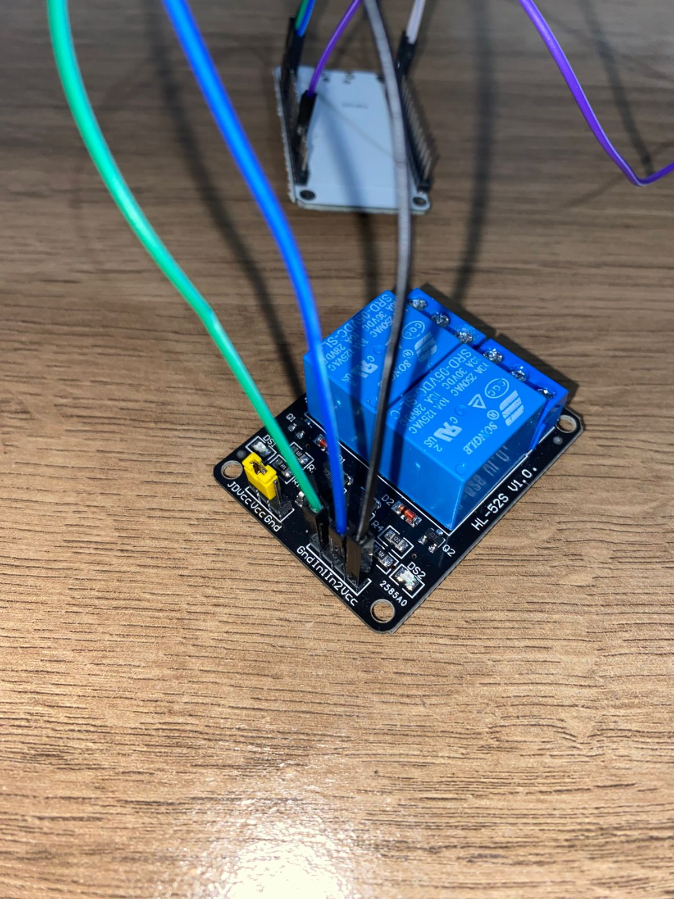
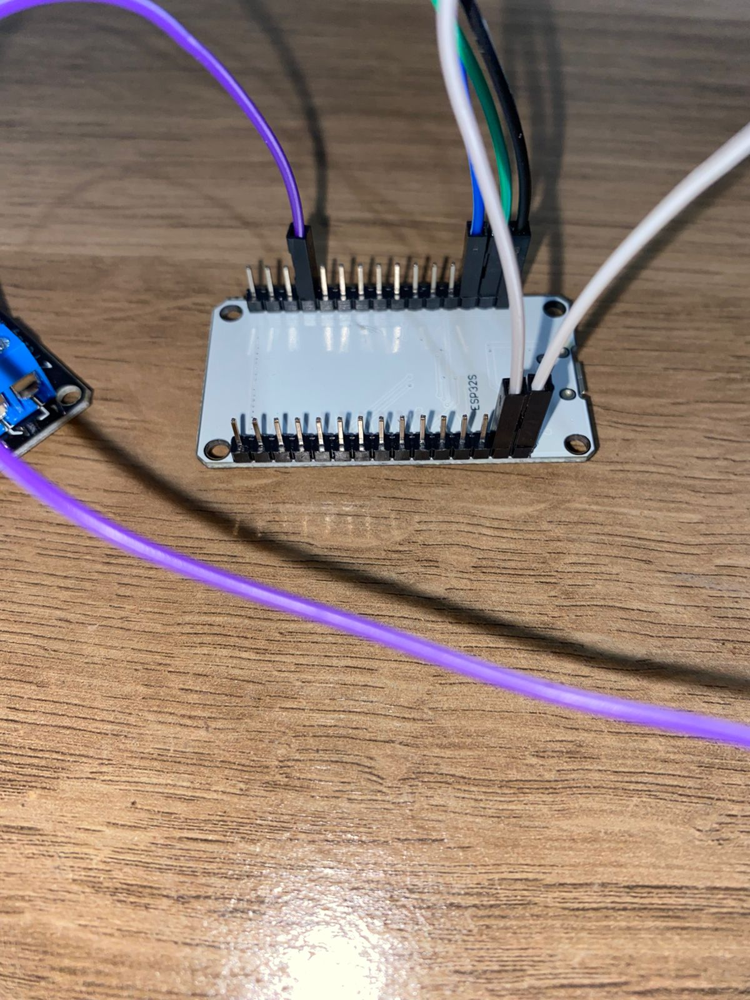
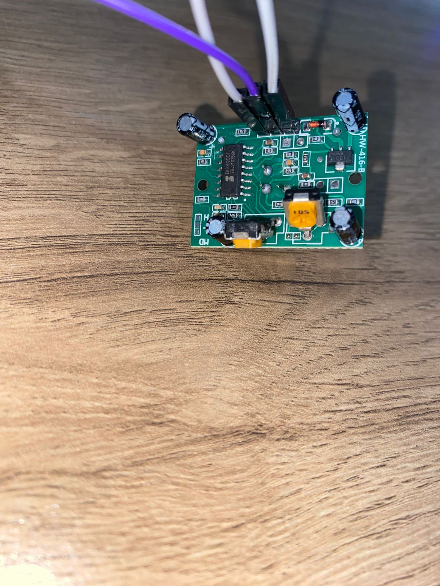

Bem-vindo ao nosso projeto de Objetos Inteligentes - IoT!

O avanço da tecnologia e a popularização da Internet das Coisas (IoT) têm revolucionado diversas áreas, incluindo a automação residencial e comercial. Um dos aspectos impactados é o sistema de iluminação, que deixou de ser um simples conjunto de lâmpadas controladas por interruptores para se transformar em uma rede inteligente, capaz de otimizar o consumo de energia, aumentar a segurança e proporcionar maior conforto aos usuários. Este projeto propõe o desenvolvimento de um sistema de iluminação inteligente baseado em IoT, voltado especialmente para ambientes empresariais. O sistema será capaz de acender as luzes automaticamente ao detectar movimento, apagar na ausência de atividade e permitir o controle remoto, possibilitando a gestão das luzes a partir de um dispositivo móvel.

Abaixo segue imagens do projeto realizado: 

Imagens da Implementação: 

Imagens do Projeto:

